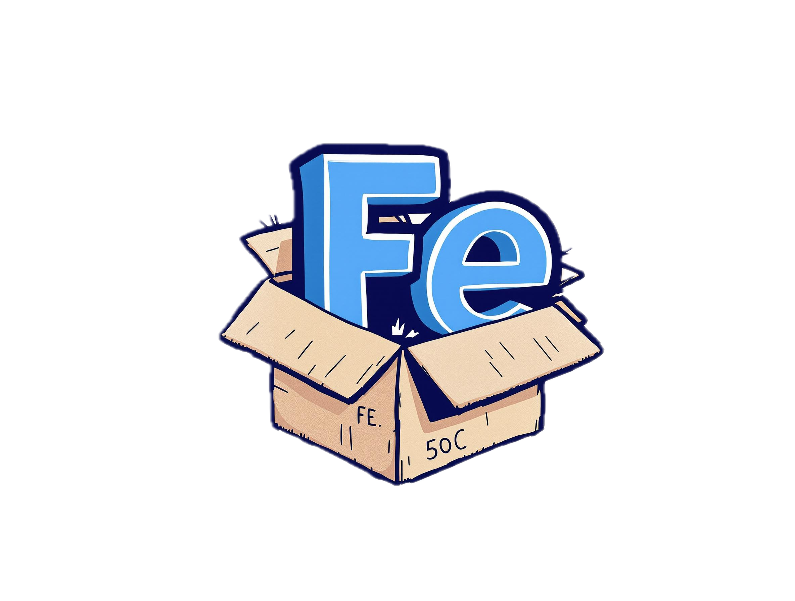

# ironcore-in-a-box

[](https://api.reuse.software/info/github.com/ironcore-dev/ironcore-in-a-box)
[](LICENSE)
[](https://makeapullrequest.com)

<p align="center">
  
</p>

## Overview

**IronCore in a Box** is a project that brings up the IronCore stack inside a local [kind](https://kind.sigs.k8s.io/) cluster. It provides a local demo environment to illustrate the capabilities of IronCore.

This project supports **Linux**, **macOS**, and **Windows (via WSL2)** environments.

## Prerequisites

Ensure you have the following installed before running the project:

* [curl](https://curl.se/)
* [make](https://www.gnu.org/software/make/)
* [go](https://go.dev/)
* [docker](https://www.docker.com/)

### Linux Kernel Requirements

IronCore relies on specific Linux kernel features. Ensure your kernel has the following configurations enabled, at least as modules (=m):

* CONFIG_LWTUNNEL
* CONFIG_LWTUNNEL_BPF
* CONFIG_IPV6_TUNNEL

Most modern Linux distributions have these enabled by default. However, minimal installations or older versions might require a custom kernel build or module loading.

**Windows/WSL2 Users:** The default WSL2 kernel often lacks these options. You will likely need to compile a custom kernel. Please follow the specific instructions here: [Compiling a Custom WSL2 Kernel](docs/windows_wsl2_kernel.md).

## Installation

**Important for Windows/WSL2 Users:** Please ensure you have followed the [WSL2 Custom Kernel Guide](docs/windows_wsl2_kernel.md) *before* proceeding with the installation if the required kernel modules are missing.

To set up and start the IronCore stack, run the following command from the root of this repository:

```sh
make up
```


This command will:
1.  Create a local kind cluster (if it doesn't exist).
2.  Deploy the IronCore stack components into the cluster.

## Cleanup

To remove the kind cluster and all deployed resources, run:

```sh
make down
```


This will effectively stop and delete the entire local IronCore environment created by this project.

## License

[Apache-2.0](LICENSE)
